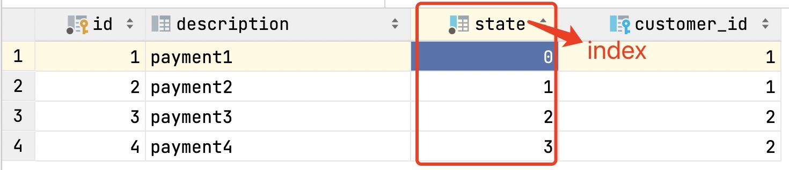

# Mysql Transaction and Lock

----

+ mysql version: 8, view locks in table: `performance_schema.data_locks`, for versions prior to version 8, they are in table `information_schema.innodb_locks`.

Read Material: 
+ [InnoDB Locking](https://dev.mysql.com/doc/refman/8.0/en/innodb-locking.html#innodb-gap-locks)
+ [Transaction Isolation Levels](https://dev.mysql.com/doc/refman/8.0/en/innodb-transaction-isolation-levels.html)

### REPEATABLE READ
#### 1. lock on (normal)index
Gap lock would be created. Be careful, a gap, not just the index you are searching

> For a unique index with a unique search condition, InnoDB locks only the index record found, not the gap before it; 
> For other search conditions(not unique index), InnoDB locks the index range scanned, using gap locks or next-key locks to block insertions by other sessions into the gaps covered by the range.([source](https://dev.mysql.com/doc/refman/8.0/en/innodb-transaction-isolation-levels.html))

For example:

##### Example1
+ **query**:
 ```
  START TRANSACTION;
  SELECT * FROM payment WHERE state = 2 FOR UPDATE;
  SELECT OBJECT_NAME, INDEX_NAME, LOCK_TYPE, LOCK_MODE, LOCK_STATUS, LOCK_DATA FROM performance_schema.data_locks;
  COMMIT ;
+ ```

+ **lock** from `performance_schema.data_locks`:

| OBJECT\_NAME | INDEX\_NAME | LOCK\_TYPE | LOCK\_MODE | LOCK\_STATUS | LOCK\_DATA |
| :--- | :--- | :--- | :--- | :--- | :--- |
| payment | NULL | TABLE | IX | GRANTED | NULL |
| payment | state\_index | RECORD | X | GRANTED | 2, 3 |
| payment | PRIMARY | RECORD | X,REC\_NOT\_GAP | GRANTED | 3 |
| payment | state\_index | RECORD | X,GAP | GRANTED | 3, 4 |

##### Example2
+ **query**: 
 ```
  START TRANSACTION;
  SELECT * FROM payment WHERE state = 0 FOR UPDATE;
  SELECT OBJECT_NAME, INDEX_NAME, LOCK_TYPE, LOCK_MODE, LOCK_STATUS, LOCK_DATA FROM performance_schema.data_locks;
  COMMIT ;
+ ```
+ **lock** from `performance_schema.data_locks`:

| OBJECT\_NAME | INDEX\_NAME | LOCK\_TYPE | LOCK\_MODE | LOCK\_STATUS | LOCK\_DATA |
| :--- | :--- | :--- | :--- | :--- | :--- |
| payment | NULL | TABLE | IX | GRANTED | NULL |
| payment | state\_index | RECORD | X | GRANTED | 0, 1 |
| payment | PRIMARY | RECORD | X,REC\_NOT\_GAP | GRANTED | 1 |
| payment | state\_index | RECORD | X,GAP | GRANTED | 1, 2 |

##### Example3
+ The SELECT FOR UPDATE is locking between 3 and the next value in the payment table. Since there is no next-value, it is locking until the **supremum pseudo-record**.
+ **query**: 
+ ```
  START TRANSACTION;
  SELECT * FROM payment WHERE state = 3 FOR UPDATE;
  SELECT OBJECT_NAME, INDEX_NAME, LOCK_TYPE, LOCK_MODE, LOCK_STATUS, LOCK_DATA FROM performance_schema.data_locks;
  COMMIT ;
+ ```
+ **lock** from `performance_schema.data_locks`:

| OBJECT\_NAME | INDEX\_NAME | LOCK\_TYPE | LOCK\_MODE | LOCK\_STATUS | LOCK\_DATA |
| :--- | :--- | :--- | :--- | :--- | :--- |
| payment | NULL | TABLE | IX | GRANTED | NULL |
| payment | state\_index | RECORD | X | GRANTED | supremum pseudo-record |
| payment | state\_index | RECORD | X | GRANTED | 3, 4 |
| payment | PRIMARY | RECORD | X,REC\_NOT\_GAP | GRANTED | 4 |


